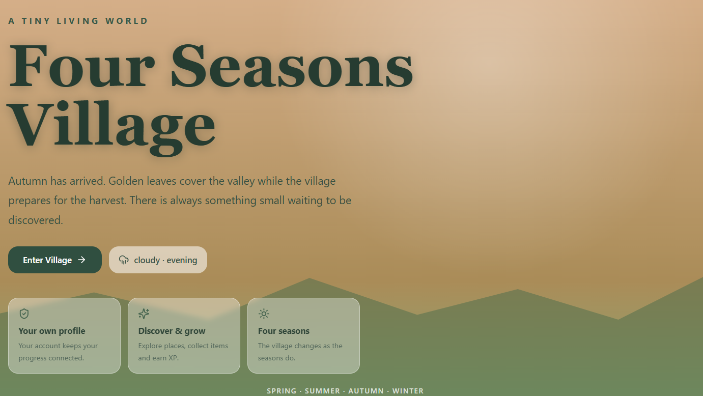
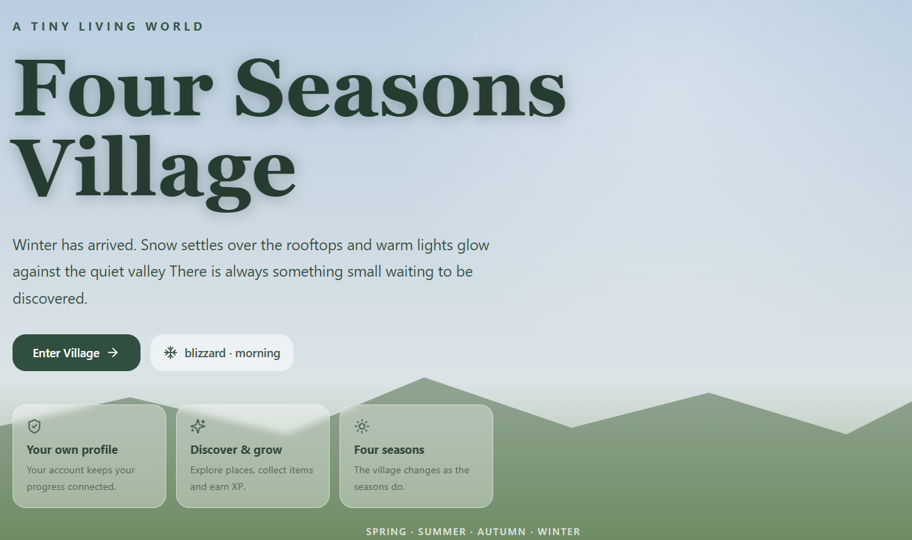
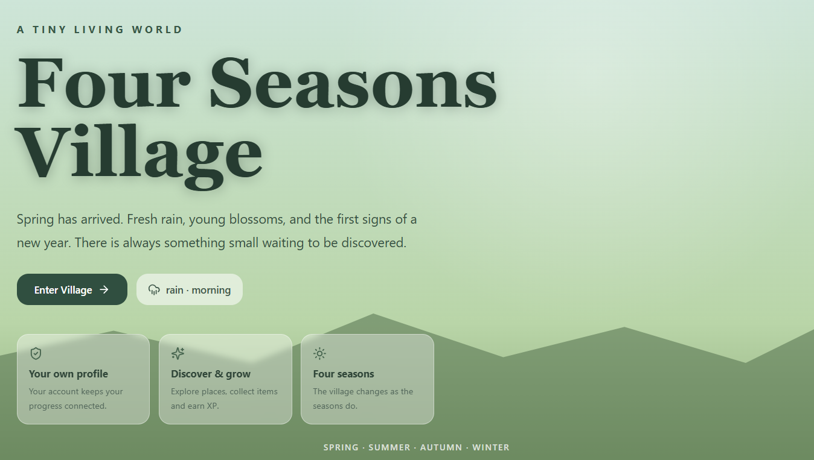
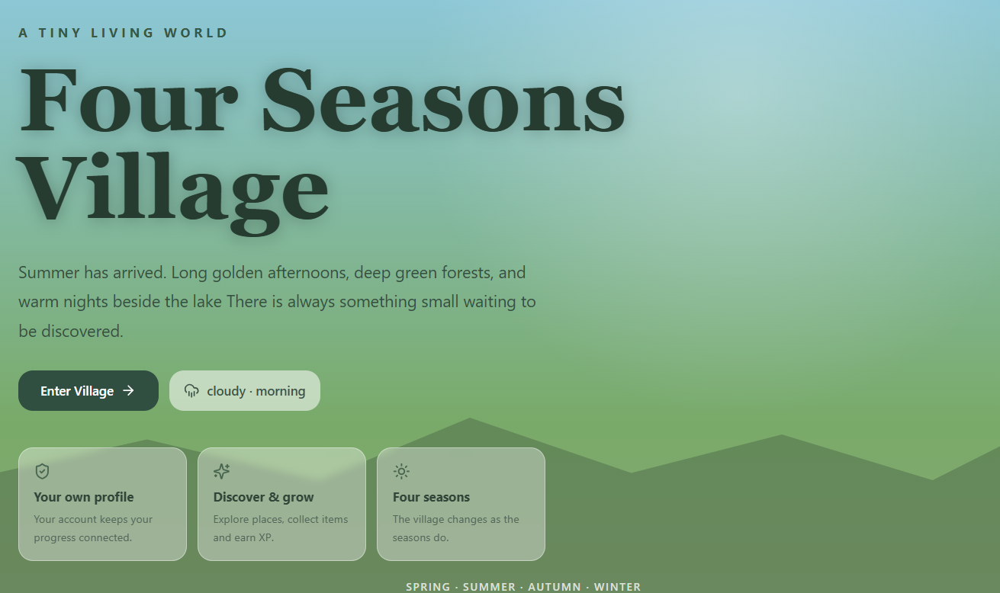
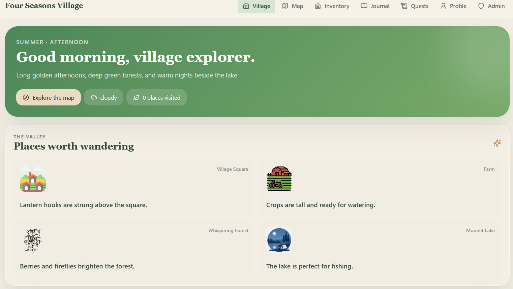
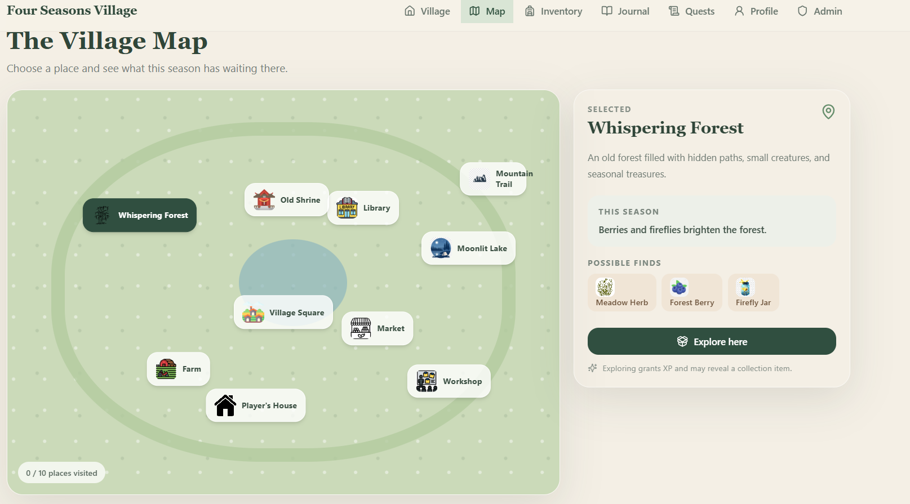
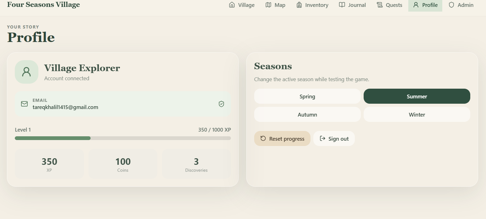
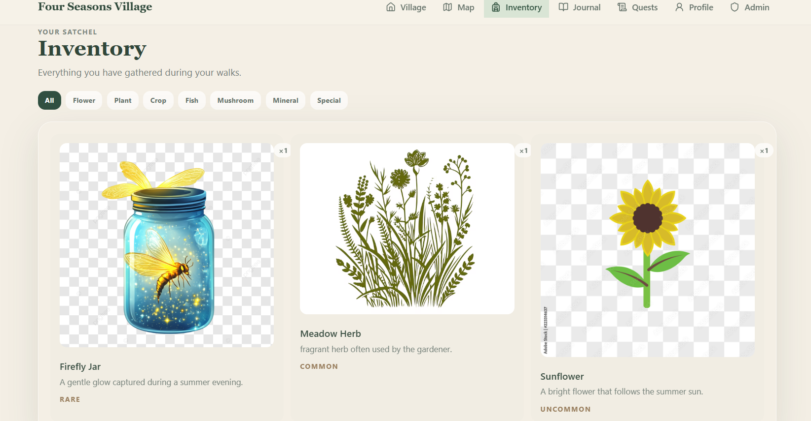
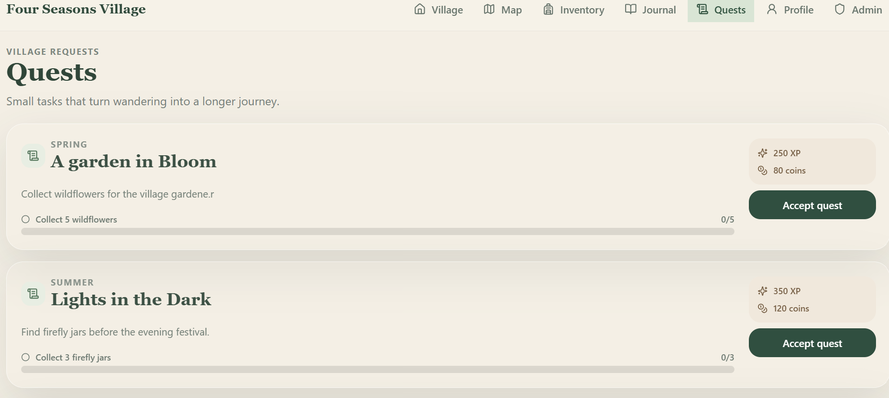
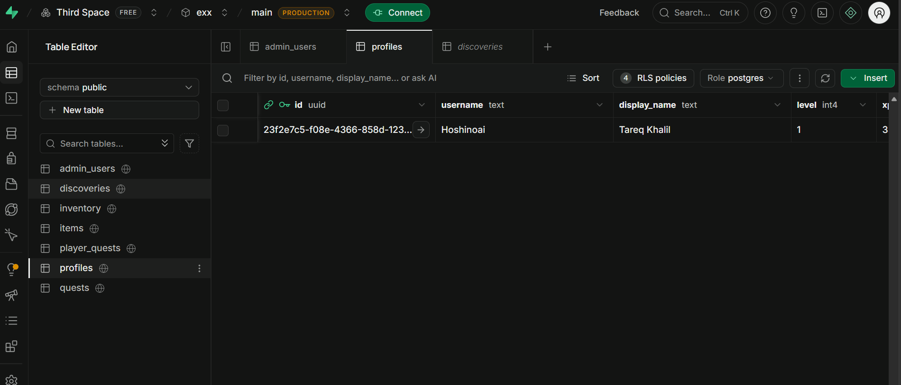

# Four Seasons Village

A cozy interactive village game where players explore a changing world, manage resources, dicover locactions, and progress his own storyline.

    

    

    

    

    <strong Explore. Discover. Build your story.>

---

## Overview

Four Seasons Village is a simple interactive web-based game, in its initial phase, built around exploration, progression, inventory management, stroytelling.

Players can create their own account, enter their village, explore different locations, collect and manage cool items, and experience their own world by their choice.

---

## Team

Four Seasons Village is being developed by:
| Team Member | Role | Contact |
|---|---|---|
| Tareq Khalil | Lead Developer | [Github](https://github.com/Tareq-Khalil) |
| Mazen Khalil | Backend Developer | [Github](https://github.com/mazenahmed1721)|
| Mohamed Salama | Ui/Ux Developer | [Github](https://github.com/MADO3308)
---

## Explore 

After creating your account you can start exploring your village.
### Village

    

The main village acts as the central gub where players can access multiple areas and discover new things.

### Interactive Map

    

Use your map to explore your own village and travel between different locations.

### Player Profile

    

Track your own progress, level, resources and other things from your profile page.

### Inventory

    

Collect items and manage them through the inventory page

### Quests

    

---

## Database

We used Supabase as our database and for Authentication(We also made the data saved in the Local Storage). Your will find the sql codes to create the suitable tables in  "supabase sql table codes" folder.

    

